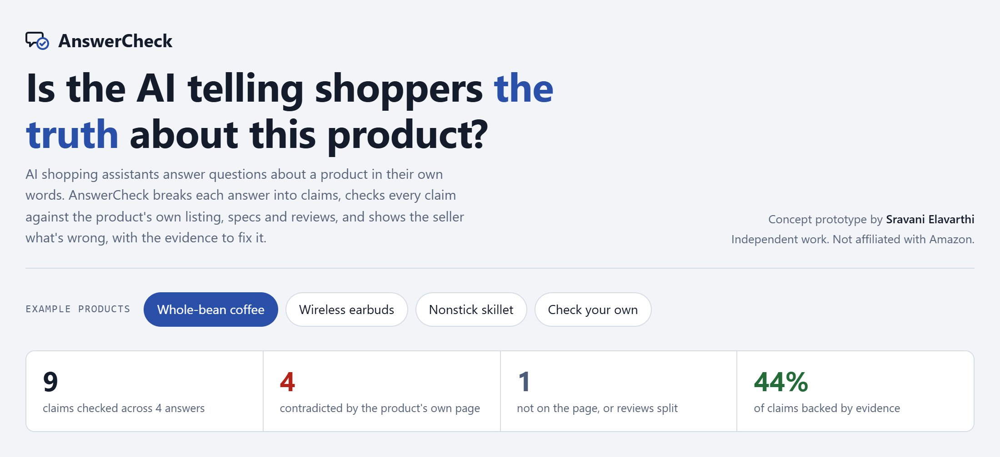
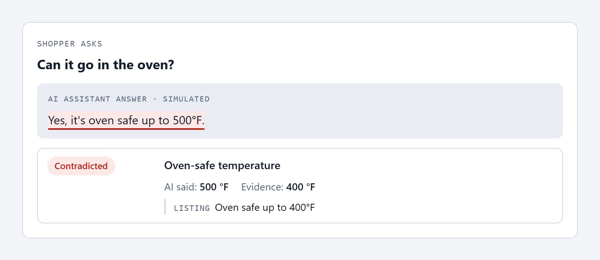
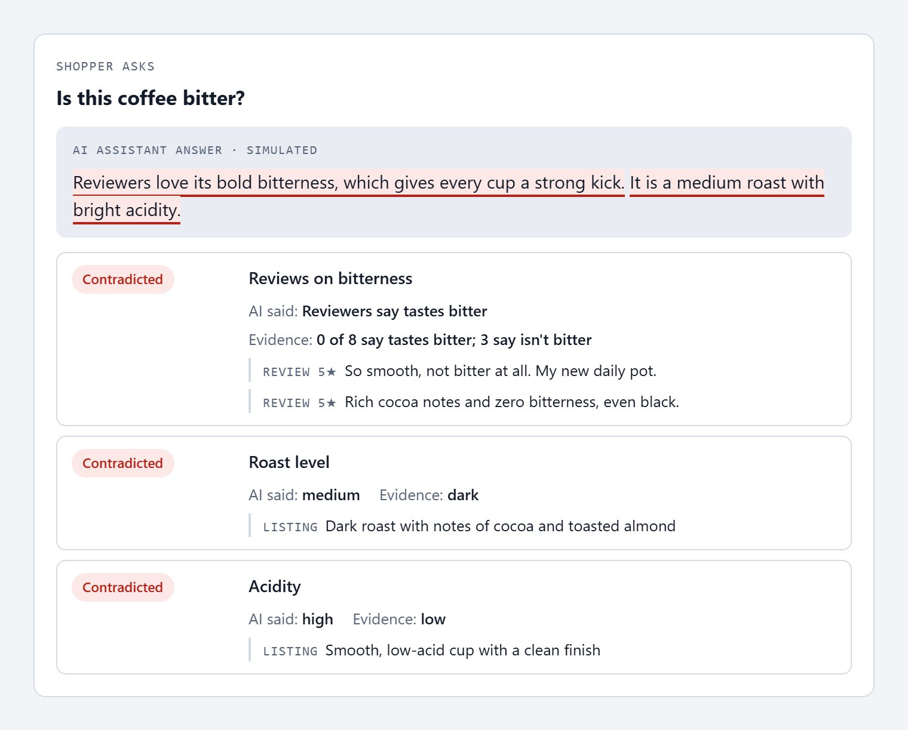
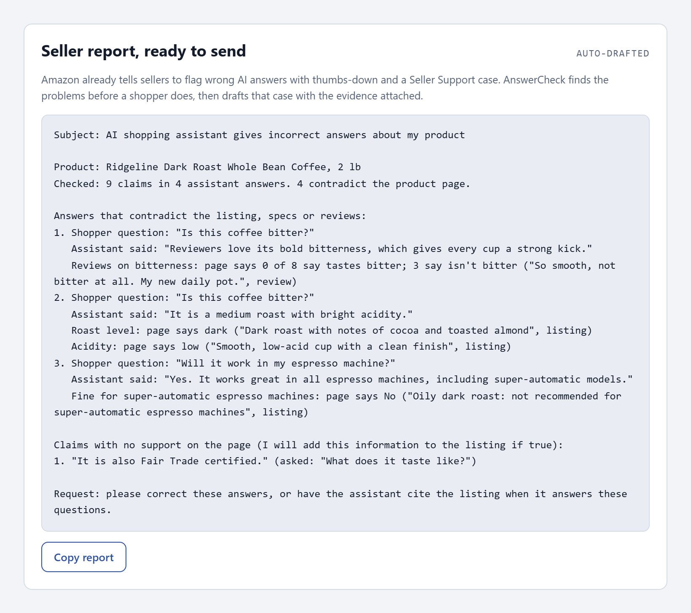

# AnswerCheck

**When an AI tells a shopper something about a product, is it true?**

AnswerCheck reads an AI shopping assistant's answers, splits them into single claims, and checks each claim against the product's own listing, specs and reviews. It shows the seller every wrong answer, the evidence that proves it, and a report ready to send.

**Try it live → https://sravani150602.github.io/answercheck/**



---

## The customer problem

A shopper asks, *"Can this pan go in the oven?"* The assistant answers, *"Yes, it's oven safe up to 500°F."* The listing says 400°F. The shopper believes the answer, because there is no reason not to. The pan warps, and the shopper returns it and loses some trust in the assistant.

This matters because shoppers now ask before they read. More than 300 million customers had used Rufus before it became **Alexa for Shopping** on May 13, 2026, and it's now the default for signed-in US shoppers. The listing can be accurate while the answer isn't. A coffee seller found the assistant listing "bitterness" as a positive attribute of their coffee, though bitterness was hardly ever mentioned in their reviews. It took a forum post and a moderator to escalate it.

Today a seller finds mistakes like that by asking the assistant questions one at a time, spotting a wrong answer by chance, and filing a thumbs-down and a Seller Support case. Seller guides say there is no dedicated dashboard yet that shows what the assistant says about a product. That is manual and reactive, and it doesn't scale to a catalog.

## What AnswerCheck does

It checks every claim in every answer, and gives each one a label:

| Label | Meaning |
|---|---|
| **Contradicted** | The listing, specs or reviews say otherwise |
| **Mixed** | Reviews are split |
| **Not on the page** | Nothing on the page backs it. Either the AI guessed, or the listing is missing something |
| **Supported** | The evidence matches |

**A wrong number, caught with its evidence:**



**One answer, three wrong facts:** it says reviews praise the bitterness when they say it isn't bitter, calls it a medium roast when it's dark, and says bright acidity when the listing says low.



**A report the seller can send today,** in the shape a Seller Support case needs:



On the live page, you can hover over any check to highlight the listing line, spec or review it used. You can also pick **Check your own** and paste in a real product's page and the assistant's answers.

## Why it matters

- **Shoppers** get answers they can trust, and fewer surprises when the box arrives.
- **Sellers** see what the AI says about their products in one view, instead of asking it one question at a time.
- **Amazon** gets fewer returns and bad reviews caused by wrong answers. It also protects the thing that makes an assistant worth asking: shoppers believing it.

## How it works

The prototype runs entirely in the browser, with no API key and no data sent anywhere. `js/engine.js` runs four kinds of checks on each sentence of an answer:

| Check | Example | How it decides |
|---|---|---|
| Yes/no features | "dishwasher safe", "works on induction", "waterproof" | Compares the answer with the listing and specs, and understands negations like "Hand wash recommended" or `Induction: No` |
| Categories | "medium roast", "bright acidity" | The value must match the value on the page |
| Numbers with units | "10 hours per charge", "500°F", "IPX7" | Compares numbers within a 5% tolerance |
| Claims about reviews | "reviewers say nothing sticks" | Counts reviews that say the product has the quality against reviews that say it doesn't |

**How it would work at Amazon's scale:**

1. Sample the questions customers actually ask about each product.
2. Split answers into claims with a language model.
3. Check each claim against retrieved evidence with an entailment model, tuned on human-labeled examples so "contradicted" really means contradicted.
4. Show sellers a per-product accuracy view with one-click reporting.
5. Feed contradictions back to the assistant, so it cites the page or says "the listing doesn't say" instead of guessing.

## What I don't know yet

- The demo uses **fictional products and simulated answers**. I have not yet measured how often real answers are wrong.
- Amazon very likely measures answer quality internally. AnswerCheck's contribution is giving **sellers** that view, with the evidence attached.
- The prototype's rules cover common product facts. A production version needs a learned model to handle everything shoppers ask.

The next step I'd take: run this on 100 real products across 5 categories, measure the contradiction rate, and bring the numbers.

## Run it locally

```bash
git clone https://github.com/sravani150602/answercheck.git
cd answercheck
python3 -m http.server 8000     # open http://localhost:8000
npm test                        # 7 engine tests (Node 18+)
```

```
index.html          the page
css/style.css       styles (light and dark, responsive)
js/engine.js        claim extraction and checking
js/data.js          three fictional example products
js/app.js           UI: rendering, evidence highlighting, report, paste mode
tests/              engine tests (node:test)
docs/screenshots/   images in this README
```

## Sources

- [Canopy Management: Alexa for Shopping replaces Rufus (2026)](https://canopymanagement.com/amazon-alexa-for-shopping-sellers-guide/)
- [Amazon Seller Forums: the "bitterness" case](https://sellercentral.amazon.com/seller-forums/discussions/t/7b947c81-e7ee-43dc-a024-a84e83458baa)
- [Amazon Seller Forums: reporting wrong answers with thumbs-down and Seller Support](https://sellercentral.amazon.com/seller-forums/discussions/t/38a7533e-d7d7-464c-9680-0e8e3f2a37a8)
- [Perpetua: no dedicated seller dashboard for Alexa for Shopping (2026)](https://perpetua.io/blog-alexa-for-shopping-amazon-rufus-the-complete-guide-for-brands-and-sellers/)
- [TheStreet / YouGov: consumer trust in AI shopping assistants](https://www.thestreet.com/personal-finance/amazons-rufus-other-ai-shopping-assistants-face-consumers-concerns)

*This is an independent project, **not affiliated with Amazon**. I built it with AI assistance, and I can walk through every decision in it.*

---

## About me

**Sravani Elavarthi** · Software Engineer · Ashburn, VA

Amazon has been my dream company for three years. After many applications and automated rejections, I decided to show you how I think instead of telling you: find a problem customers and sellers actually hit, check what already exists, and build something you can click.

- **MS in Data Science**, University of Maryland, College Park (2024–2026), GPA 3.8/4.0. Teaching Assistant for Machine Learning, and earlier for Data Structures & Algorithms and Database Systems.
- **Software Development Engineer**, Quadrant Technologies, on a Microsoft client project (2025–2026): Java/Spring Boot REST APIs, Redis caching, CI/CD with GitHub Actions.
- **Graduate Research Assistant**, UMD Office of Research Administration (2024–2025): Python automation, SQL schemas, serverless cloud functions.
- **Software Engineer**, Cognizant Technology Solutions (2023–2024): backend microservices in Java and Python with Docker and Kubernetes.
- **Software Development Engineer Intern**, Wiley India (2023): backend APIs in Python and Java.
- **AWS Certified Solutions Architect – Associate** and **AWS Certified Cloud Practitioner**.

**Reach me:** [LinkedIn](https://linkedin.com/in/sravani-elavarthi) · [GitHub](https://github.com/sravani150602) · sravanireddy1506@gmail.com

MIT License · © 2026 Sravani Elavarthi
